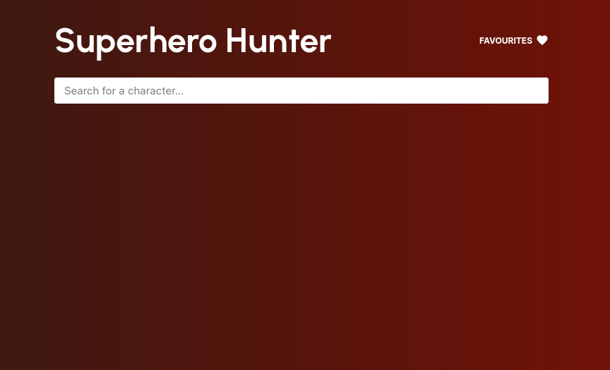
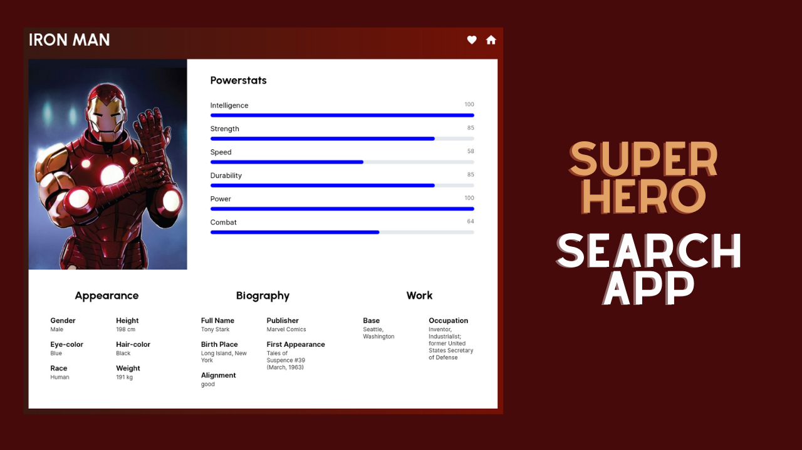
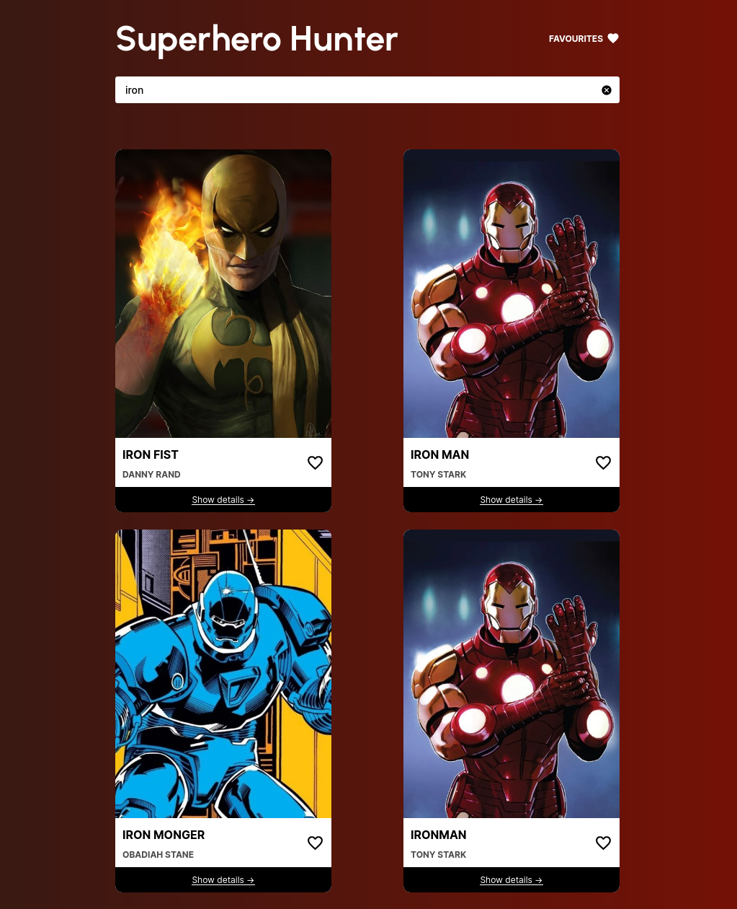
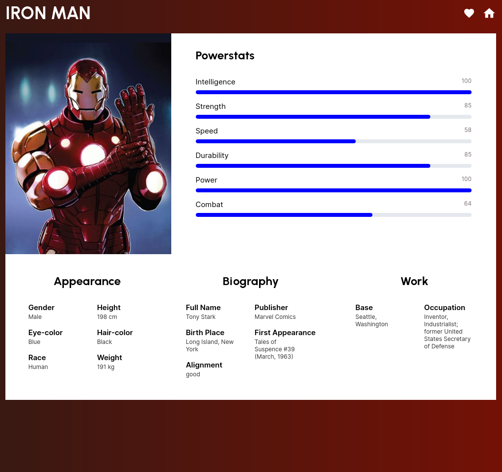
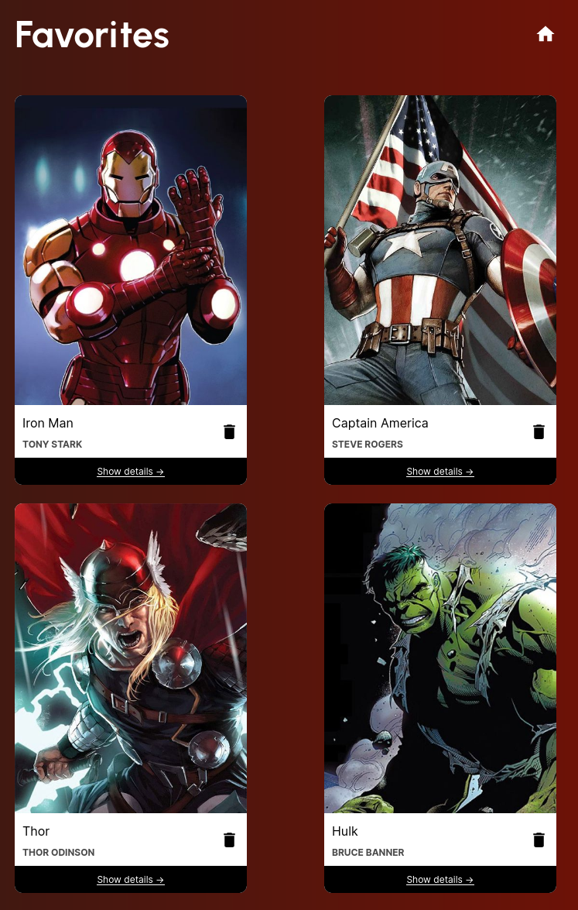

# superhero-hunter-app 

### Fetch data of all superheroes in a presentable way with an option to mark a hero as favourite and check later.

### Youtube Video Link
<a href="https://youtu.be/PM1YDiCKeKg">Click to watch live demo</a>

### Home Page - home.html

- The main page of the project is to search for superheroes. 
- Press press the 'Enter' key after typing the hero name for better results.
- Results will keep showing as you start typing. 
- A character can be marked as a favourite by clicking on the heart button.

### Hero Detail Page - hero.html
- Show the details of a particular hero which include features like power stats, biography, appearance and more.

### Favorite Page - favorites.html
- Show all the characters marked as a favourite. 
- Clicking on the trash button removes the character from favourites.

### Technology Used
- HTML/CSS, JavaScript
- Local Storage

### Improvements to be Done
- Response time can be improved
- Since, asynchromous calls are made, the responses of successive requests are received in unordered manner.

Project Done under guidance of <a href="https://www.codingninjas.com/" target="_blank">Coding Ninjas</a>

